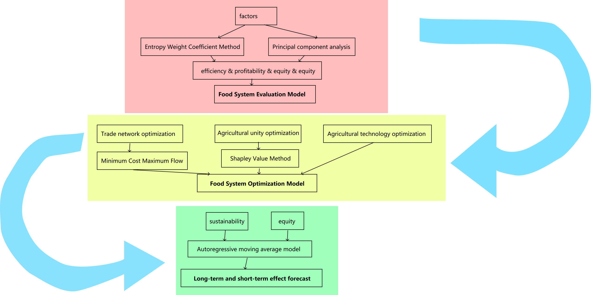

第一部分:食物系统评价模型
    相关性分析
    
    熵权法

    综合评价：
        PCA方法计算效率
        计算收益 可持续性 
        得出部分国家得分
    计算食物系统基尼系数
    得出当前食物系统综合评估值

第二部分优化
1.贸易网络优化 

2.技术扶持优化
    方法描述，画出图
    分析结果
3.国家联合优化
    将四个国家视为一个整体
    国家内部Shapley值分配
    计算10年后总产量
    分析结果

第三部分预测：
    2050年粮食产量预测，平滑自回归方法
    根据2050年人均消费粮食计算，得到世界人口容量上上限的变化
    分析结果

伸缩性分析 

