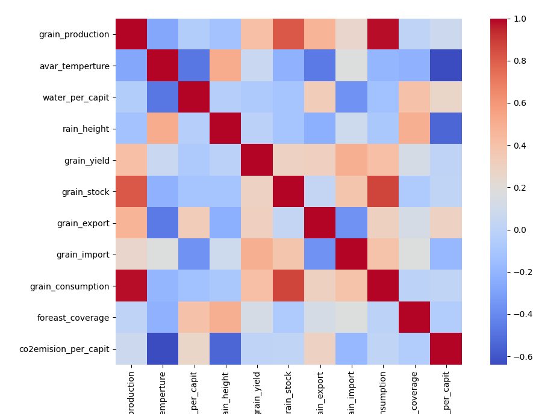

## 相关性分析
在评估整体食物系统的评价标准之前，首先要对分析的变量进行相关性分析。通过相关性分析找到不同影响因素之间的相关关系。找到可能影响我们的评估模型的那些因素。在具体的计算过程中，我们使用皮尔逊相关系数计算。
Before evaluating the evaluation criteria of the overall food system, we must first analyze the correlation of the analyzed variables. Find the correlation between different influencing factors through correlation analysis. Find those factors that may affect our evaluation model. In the specific calculation process, we use the Pearson correlation coefficient calculation.
皮尔逊相关系数的特点是两个变量的位置和尺度的变化并不会引起该系数的改变
The characteristic of Pearson's correlation coefficient is that changes in the position and scale of the two variables will not cause the coefficient to change
两个变量之间的皮尔逊相关系数定义为两个变量的协方差除以它们标准差的乘积：
The Pearson correlation coefficient of two variables is defined as the covariance of the two variables divided by the product of their standard deviations:

$$\rho_{X, Y}=\frac{\operatorname{cov}(X, Y)}{\sigma_{X} \sigma_{Y}}=\frac{E\left[\left(X-\mu_{X}\right)\left(Y-\mu_{Y}\right)\right]}{\sigma_{X} \sigma_{Y}}$$

通过对所有的因素之间，每两个都计算皮尔逊相关系数，我们得到了如下的相关性系数矩阵
By calculating the Pearson correlation coefficient between all the factors, we get the following correlation coefficient matrix

从上图可以发现，
1.食物的生产量和食物的消费量具有很高的相关性。粮食处于人类生存需求的最低层，当人们对粮食的基本需求得到满足后，常常将更多的时间和精力用于追求其他物质和服务的享受，因而粮食安全问题也往往容易被忽视。但一旦粮食保障出现问题时，其波及效应却非常明显。因此各国生产粮食首先用于国内利用。

We found from the figure above,
1. Food production and food consumption have a high correlation. Food is at the lowest level of human survival needs. When people's basic needs for food are met, they often spend more time and energy in pursuing the enjoyment of other materials and services. Therefore, food security issues are often overlooked. But once there is a problem with food security, its ripple effect is very obvious. Therefore, food produced by various countries is first used for domestic use.
2.CO2排放增加会导致全球气候变暖、极端天气增多，从而使南北极积雪融化、海平面上升、极端旱涝灾害频发、沿海三角洲被淹没等。传统化石能源燃烧产生的CO2是造成温室效应的主要原因。
由上图发现人均CO2排放量和平均气温具有较高的负相关性。这是因为人均CO2排放量较高的国家主要是发达国家。大部分的发达国家在高纬度地区，平均气温较低。
Increasing CO2 emissions will lead to global warming and more extreme weather, which will cause melting of snow in the Arctic and Antarctic, rising sea levels, frequent extreme droughts and floods, and inundation of coastal deltas. The CO2 produced by the burning of traditional fossil energy is the main cause of the greenhouse effect.
From the above figure, it is found that there is a high negative correlation between per capita CO2 emissions and average temperature. This is because the countries with higher per capita CO2 emissions are mainly developed countries. Most of the developed countries are in high latitudes, where the average temperature is low.
3.粮食的库存量和粮食的消费量具有较高的关联性。粮食的消费量越大，一个国家所需要的储存粮食也就越大，用来保证国内粮食的稳定供应，这是符合我们一贯的常识。
3. Grain stock and food consumption have a high correlation. The greater the consumption of grain, the greater the amount of grain a country needs to store to ensure a stable supply of domestic grain. This is consistent with our usual common sense.