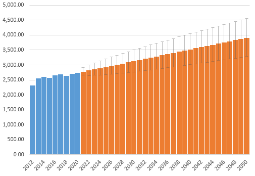

## 长短期影响未来预测
为了预测我们改变粮食系统带来的成本，我们将成本和好处分为短期的和长期的。
In order to predict the cost of changing our food system, we divide the costs and benefits into short-term and long-term.
对于短期影响，国家农业联合组织的政策稳定性也是对这一合作模式的考验，如何使用尽可能短的时间在农业联合体中建设需要的基础建设，成本如何分担是急需解决的问题，这些问题会随着时间不断推进解决。优化了贸易网络之后对农产品出口国会造成盈利能力的下降。盈利的下降导致经济效益相对较高的经济作物种植面积增加，促使粮食生产面积减少，农作物产品品种单一化的现象。但同时，粮食生产面积减少后，更多的土地可以恢复生态，提高可持续发展指数，同时由于农业弱国也可以以合理的价格获取粮食，提高了整个食物系统的公平性。
For the short-term impact, the policy stability of the National Agricultural Union is also a test of this cooperation model. How to use the shortest possible time to build the necessary infrastructure in the agricultural complex, and how to share the cost are problems that need to be solved urgently. It will continue to be resolved over time. After optimizing the trade network, the profitability of agricultural products exporters decreased. The decline in profitability has led to an increase in the planting area of cash crops with relatively high economic benefits, leading to a decrease in the area of grain production and the simplification of crop products. But at the same time, after the area of food production is reduced, more land can be restored to the ecology and the sustainable development index can be improved. At the same time, because agricultural countries can also obtain food at a reasonable price, the fairness of the entire food system is improved.
对于长期影响，经过长期的发展以后，粮食的生产量的到了大幅度的提高，但是人均粮食需求量的提高不大。世界人口容量会逐步提高。因此，对于粮食出口国家在短期影响上受到的。在未来的几十年更加重要的是做到对粮食的合理利用，这需要各个国家与世界一起从政策的角度关注和引导消费者选择更合适的粮食加工产品。同时引导对贫困农民参与农业生产的能力，从而降低人均食物利用基尼系数，提高世界食物系统的公平性。
For the long-term impact, after long-term development, the output of grain has increased substantially, but the increase in per capita grain demand is not significant. The world population capacity will gradually increase. Therefore, the short-term impact on food exporting countries is affected. In the next few decades, it is more important to make rational use of food. This requires countries and the world to pay attention to and guide consumers to choose more suitable food processing products from a policy perspective. At the same time, the ability of poor farmers to participate in agricultural production is guided, thereby reducing the Gini coefficient of per capita food utilization and improving the fairness of the world food system.

使用Autoregressive moving average model对未来粮食生产量的预测
Use Autoregressive moving average model to predict future food production
ARMA fomula
$$
X_{t}=c+\varepsilon_{t}+\sum_{i=1}^{p} \varphi_{i} X_{t-i}+\sum_{j=1}^{q} \theta_{j} \varepsilon_{t-j}
$$
预测2050年世界粮食产量
Forecast of world food production in 2050

根据人口需求量测算，粮食产量可以满足215亿人口的需要，根据联合国人口估计。那个时候的人口增长到约97亿。如果我们可以充分的利用生产出来的粮食，尽可能的降低浪费。我们可以减少一半低产量的耕地，节省更多的水资源，种植更多的森林。可持续发展指数将进一步提高。同时由于世界发展程度的提高，在短期中收益受到影响的农作物进口国家。由于世界人口增多，拥有了更大的市场，这些短期内受到影响的国家可以通过出口更多的其他消费品在未来弥补损失。其实这是一种对效率和盈利能力的提高。
According to population demand estimates, food production can meet the needs of 21.5 billion people, according to UN population estimates. The population at that time grew to approximately 9.7 billion. If we can make full use of the food produced, reduce waste as much as possible. We can reduce the low-yield arable land by half, save more water resources, and plant more forests. The sustainability index will be further improved. At the same time, due to the increase in the degree of world development, crop importing countries whose profits are affected in the short term. As the world’s population increases and has a larger market, these countries that are affected in the short term can make up for losses in the future by exporting more other consumer goods. In fact, this is an improvement in efficiency and profitability.