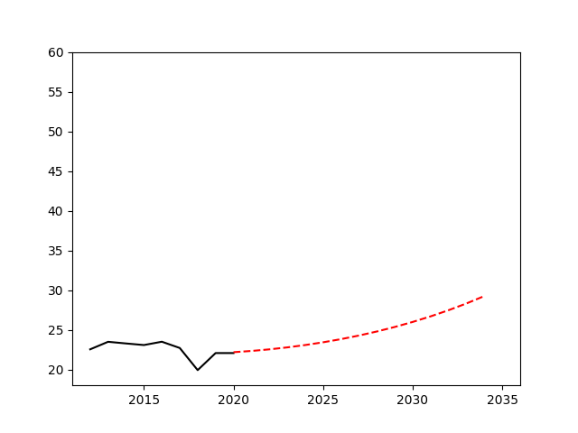
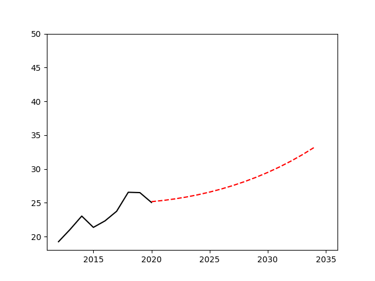
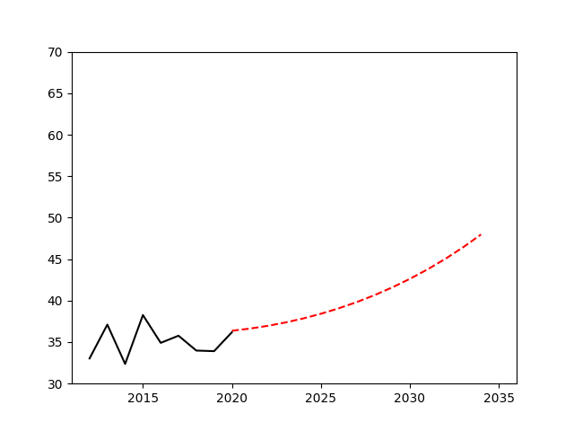
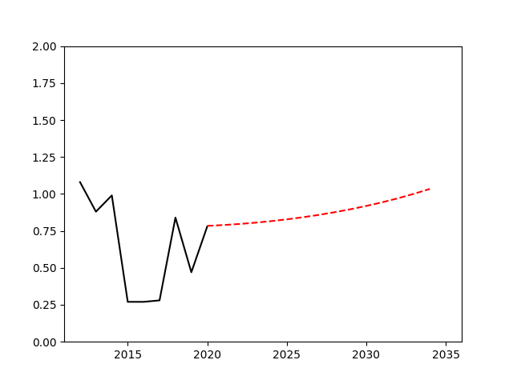

## 农业技术优化
世界各个地区的农业条件除了自然资源条件的差异以外，还有农业技术的差异，如果我们能使得落后国家能获取先进的农业技术，农业生产率就可以逐步的提高。如果每一年农业的增长率的加速度能每年提高0.2%，对于以下四个国家未来农业生产量的变化如下
In addition to differences in natural resource conditions, agricultural conditions in various regions of the world also have differences in agricultural technology. If we can enable backward countries to obtain advanced agricultural technology, agricultural productivity can gradually increase. If the acceleration of the agricultural growth rate can increase by 0.2% per year, the changes in future agricultural production for the following four countries are as follows
Egypt

Nigeria

Turkey

Saudi Arabia

分析 通过提高农业技术的方法，在10年后这四个国家的粮食生产总量可以提升到99百万吨,比当前的谷物产量提高了百分之3.6
通过这种方法需要一定的学习成本，包括需要提供现在农业所需要的设备，建立一套可持续发展的农业工业化体系，这对于极端贫穷国家是很难实现的。
如果这个方法能有效的进行，从长久来看更能满足发展需要。技术的发展往往遵循一种指数级别的规律，虽然对短期的作用有限，但是坚持方法长期应用下去获得的长期受益是十分可观的。
Analysis By improving agricultural technology, the total food production of these four countries can be increased to 99 million tons in 10 years, which is 3.6% higher than the current grain production.
This method requires a certain amount of learning costs, including the need to provide the equipment needed for agriculture and the establishment of a sustainable agricultural industrialization system, which is difficult to achieve for extremely poor countries.
If this method can be carried out effectively, it can better meet development needs in the long run. The development of technology often follows an exponential rule. Although it has limited short-term effects, the long-term benefits obtained by persisting in the long-term application of the method are very considerable.