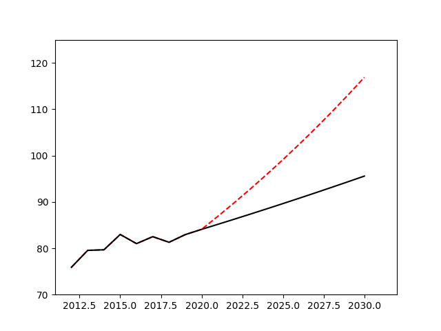

## 农业联合体优化
为了解决不同国家之间粮食生产与分配差异过大的问题,提升世界食物系统的公平性和可持续性，我们决定让一些国家组团。几个国家之间在农业合作上构成共同的农业联合体，在农业的生产环节上，共同分享农业技术，使得粮食生产的增长速度提高。在粮食的仓储上，共同储存食物，可以降低总储存量。根据调查，由于当前保存条件的限制，在粮仓中储存的食物平均每年会造成10%的浪费。对此我们选取了埃及，尼日利亚，土耳其，沙特阿拉伯国家进行联合组成农业共同体。
In order to solve the problem of excessive differences in food production and distribution between different countries, and to improve the fairness and sustainability of the world's food system, we have decided to allow some countries to form groups. Several countries form a common agricultural consortium in agricultural cooperation, and share agricultural technology in the agricultural production link, which has increased the growth rate of food production. In the storage of grain, the joint storage of food can reduce the total storage capacity. According to the survey, due to the current storage conditions, the food stored in the granary will cause an average of 10% waste every year. For this, we selected Egypt, Nigeria, Turkey, and Saudi Arabia to form an agricultural community.
在一个农业共同体中如何合理的分配粮食是一个问题。在长久的合作利益分配博弈之中产生了多种解决分配的方式。在这里我们选取Shapley值的方式解决农业联合体内部的分配问题。
How to distribute food reasonably in an agricultural community is a problem. In the long-term cooperative benefit distribution game, there have been many ways to solve the distribution. Here we choose the Shapley value to solve the distribution problem within the agricultural complex.
合作收益贡献度通过Shapley值法进行计算。Shapley值法是一种多人合作博弈利益分配方法,普遍适用于多方组合利益合理分配相关问题,表示自己所得与贡献度相等。它考虑到了联盟成员的边际贡献,满足个体理性、联盟理性、公平效率和分配结果的唯一性条件,被广泛应用于不同联盟收益分配研究
The contribution of cooperation income is calculated by Shapley value method. The Shapley value method is a multi-player cooperative game benefit distribution method, which is generally applicable to problems related to the reasonable distribution of multi-party combined benefits, which means that one's own income and contribution are equal. It takes into account the marginal contributions of alliance members, and satisfies the uniqueness conditions of individual rationality, alliance rationality, fair efficiency, and distribution results. It is widely used in the research on the income distribution of different alliances.

marginal contribution为第i个国家加入组织得到的贡献
marginal contribution is the contribution of the i-th country joining the organization
$$
\delta_ i(S)=v(S \cup\{i\})-v(S)
$$
对应的shapley值计算方法为
The corresponding shapley value calculation method is
$$
Shapley(S, i) / \varphi _ i=\sum_{r \in R} \delta_ i(S _i(r)) /|n| !
$$
通过计算得到这四个国家之间的分配系数为
The distribution coefficient between these four countries is calculated as
egypt 0.2650 
nigeria 0.3184 
turkey 0.4001
saudi arabia 0.0163

同时其余之间的合作带来了更加长期的粮食产量提升，根据测算，如果使得粮食产量的增长等于区域联合体内部增长最快国家的增长速率，粮食的生产量变化如图。
At the same time, the rest of the cooperation has brought about a longer-term increase in food production. According to calculations, if the growth of food production is equal to the growth rate of the fastest growing countries in the regional consortium, the change in food production is shown in the figure.

分析 通过区域合作的方式，10年后使得粮食生产总量提升至116.87millon tons，增长率为22%。
同时,过多的储存粮食会导致更多的粮食浪费，但是通过区域间的合作储存粮食，可以使得粮食的供应更加稳定，合作的储存粮食可以降低储存粮食的浪费，通过区域间的合作，将储存粮食的比例从20%降低到10%，每年可以减少2.3millon ton粮食的浪费，减少0.57millon ton 二氧化碳排放。将这些国家的可持续性得分增长2.03%
Through regional cooperation, 10 years later, the total food production has increased to 116.87 millon tons, a growth rate of 22%.
At the same time, too much stored food will lead to more food waste, but through inter-regional cooperation to store food can make the supply of food more stable, cooperative storage of food can reduce the waste of stored food, through inter-regional cooperation, will The proportion of stored grain is reduced from 20% to 10%, which can reduce food waste by 2.3 millon ton and 0.57 millon ton of carbon dioxide emissions per year. Increase the sustainability score of these countries by 2.03%