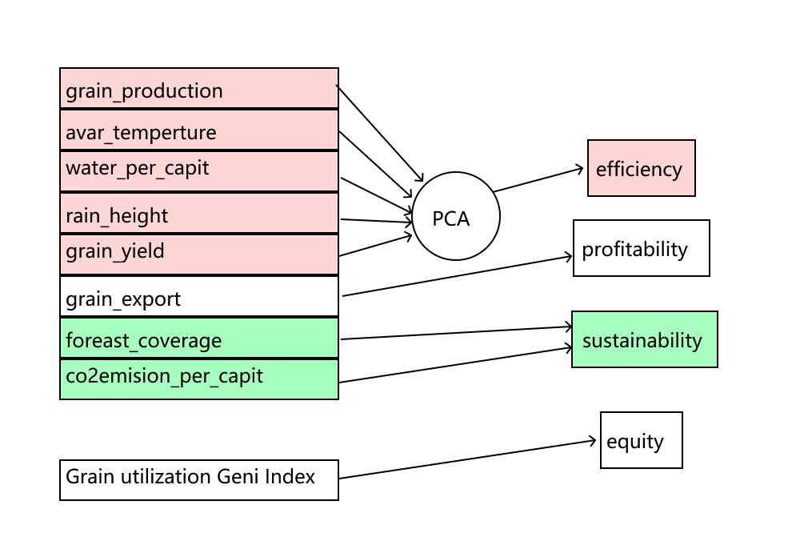
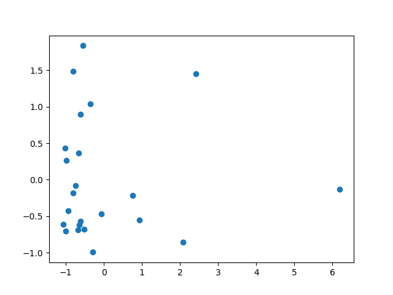
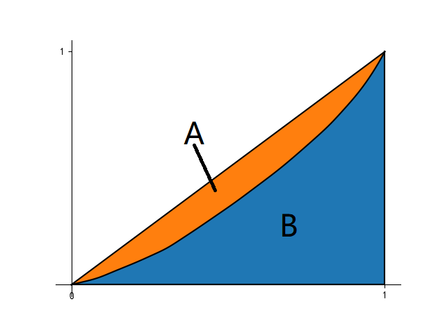

## 综合评价
在评估世界粮食系统的过程中，将评价指标分为效率，盈利能力，可持续性，公平性四个方面进行评价。
In the process of evaluating the world food system, the evaluation indicators are divided into four aspects: efficiency, profitability, sustainability, and fairness.

评估国家效率
National efficiency assessment
在粮食系统中，考虑效率因素，为了评估各个国家在不同自然条件下对农作物种植的能力水平。我们需要考虑不同国家之间自然条件的差异。因此，从平均温度，人均水资源，降雨量，农作物亩产量四个因素中通过主成分分析（PCA）方法获得两个变量。通过这两个变量评估一个国家的自然资源水平。
In the food system, efficiency factors are considered in order to evaluate the ability of various countries to grow crops under different natural conditions. We need to consider the differences in natural conditions between different countries. Therefore, two variables are obtained by principal component analysis (PCA) from the four factors of average temperature, per capita water resources, rainfall, and crop yield per mu. Evaluate a country's natural resource level through these two variables.

于是我们得到了PCA的两个成分
So we got the two components of PCA
$$T_1=a_1AT+a_2WPA+a_3RH+a_4GY$$

$$T_2=b_1AT+b_2WPA+b_3RH+b_4GY$$

$$  a_1 = -0.2207929 \ \ \ b_1 = 0.51886374\\
    a_2 = 0.97412436 \ \ \ b_2 = 0.15605308\\
    a_3 = -0.04460765 \ \ \ b_3 = 0.84049003\\ 
    a_4=-0.01850342 \ \ \ b_4 = -0.00208676
$$
数据经过主成分分析后得到的数据散点图如下
The data scatter chart obtained after the data is analyzed by principal components is as follows

Among them, T1 component accounts for 0.73016963 T2 component accounts for 0.18400768
各个国家的效率指数
Efficiency index of each country
$$EF=\frac{T1+T2}{2}$$
我们得到一些国家的效率指数
We get the efficiency index of some countries
Argentina	1.369985215
Australia	1.29012634
Brazil	3.033136376
Canada	4.130862017
China	0.420050923
Egypt	0.252087762
European Union	0.505902022
India	0.745769496
Indonesia	1.742797513
Japan	0.954229711
Kazakhstan	0.459178358
Mexico	0.691602783
Nigeria	0.812030889
Philippines	1.442616561
Republic of Korea	0.607980618
Russian Federation	1.711391614
Saudi Arabia	0.259002153
South Africa	0.423532058
Thailand	1.240999088
Turkey	0.466720456
Ukraine	0.50103828
United States of America	0.835005814
Viet Nam	1.444669473

由上文中的数据，通过对得到的指数进行分析，巴西具有较好的自然条件，有充足的水资源和耕地，亩产量相比其他国家较高。加拿大具有世界上最高的人均水资源，同时发达国家农业技术高，也获得了很高的效率评分。而埃及水资源较少，耕地亩产量较为低下，最终评分较低。因此在世界上需要选择适合发展农业的地区发展农业，才能取得较高的效率。
Based on the above data, through analysis of the obtained index, Brazil has better natural conditions, sufficient water resources and arable land, and higher yield per mu than other countries. Canada has the highest per capita water resources in the world, and developed countries have high agricultural technology and have also received high efficiency ratings. However, Egypt has less water resources and lower yield per mu of arable land, resulting in a lower final score. Therefore, in the world, it is necessary to select regions suitable for agricultural development to develop agriculture in order to achieve higher efficiency.

盈利性 和 可持续性
我们通过世界银行数据库获取了过往10年的数据。这些数据中我们发现一个国家的出口量能够反应这个国家在国际粮食市场上的影响力，可以衡量一个国家的盈利能力。
可持续性的衡量，通过一个国家的二氧化碳气体的排放，森林的覆盖率，来量化计算一个国家的绿色指数，从而反映一个国家的可持续性指数。
Profitability and sustainability
We obtained data for the past 10 years through the World Bank database. From these data, we find that a country’s export volume can reflect the country’s influence on the international grain market and can measure a country’s profitability.
Sustainability is measured by a country’s carbon dioxide emissions and forest coverage to quantify a country’s green index to reflect a country’s sustainability index.

(总得分的表)

公平性
虽然世界上的粮食生产很多，但是仍然有很多人不能获取足够的粮食的营养。在我们的粮食系统中，粮食从生产到销售有很多个环节。通过对数据的分析，我们发现发达国家和发展中国家的人均粮食消耗量有很大的差异。所以我们通过食品利用量基尼系数来衡量世界食物系统的公平性。
equity
Although there is a lot of food production in the world, there are still many people who cannot get enough food nutrition. In our grain system, there are many links from grain production to sales. Through the analysis of the data, we found that there is a big difference in per capita food consumption between developed and developing countries. So we use the Gini coefficient of food utilization to measure the equity of the world's food system.

食品利用量基尼系数的计算式通过绘制洛伦兹曲线，计算洛伦兹曲线中两个部分的面积比值，从而研究世界粮食系统中国家粮食分配不均的问题。
The Gini coefficient of food utilization is calculated by drawing the Lorentz curve to calculate the area ratio of the two parts of the Lorentz curve, so as to study the uneven distribution of national food in the world food system.
$$Geni=\frac{A}{A+B}$$

人均粮食消费量基尼系数 0.2471
Gini Coefficient of Per Capita Food Consumption
0.2471

分析 虽然人类在世界不同地区在实际情况下所需要消耗的粮食差异不大，但是发达国家和发展中国家的饮食结构有着较大的差异，发达国家的肉类饮食比重较大，而生产肉类食物需要用粮食组成的饲料，导致了发达国家的人均粮食消费量远大于低收入国家，其中最高值和最低值相差了大约8倍。
Although there is little difference in the actual food consumed by humans in different parts of the world, the dietary structure of developed and developing countries is quite different. The proportion of meat diet in developed countries is relatively large, while the production of meat Food requires a feed composed of grains, which has resulted in the per capita grain consumption in developed countries being much greater than that in low-income countries, where the difference between the highest value and the lowest value is about 8 times.